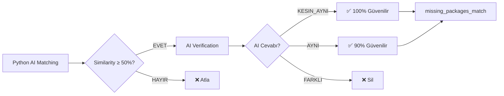

# 🎯 Eşleştirme Hiyerarşisi ve Güvenilirlik Seviyesi

> Bu dokümanda, sistemin kullandığı eşleştirme kurallarının **hiyerarşisi, güvenilirlik seviyeleri ve öncelik sırası** açıklanmaktadır.

---

## 📊 Hiyerarşi Genel Bakış

```
┌─────────────────────────────────────────────────────────────┐
│  🔑 EN GÜVENİLİR (Priority 1) - PIPELINE İLK ADIM           │
│  SKU Matching                                                │
│  ├─ SKU + Size  → %98 güvenilirlik                          │
│  ├─ SKU + Brand → %98 güvenilirlik                          │
│  └─ SKU         → %95 güvenilirlik                          │
│                                                              │
│  ⭐ SKU tedarikçi/üretici kodu olduğu için EN GÜVENİLİR!   │
└─────────────────────────────────────────────────────────────┘
                        ↓ (SKU eşleşmezse)
┌─────────────────────────────────────────────────────────────┐
│  🔗 ÇOK GÜVENİLİR (Priority 2)                              │
│  Link Matching                                               │
│  └─ Trendyol ürün ID'si birebir eşleşiyor → %100 güven     │
└─────────────────────────────────────────────────────────────┘
                        ↓ (Link eşleşmezse)
┌─────────────────────────────────────────────────────────────┐
│  📍 GÜVENİLİR (Priority 3)                                  │
│  Exact Matching - İçerik Bazlı                              │
│  ├─ Product Name + Brand + Size → %90 güvenilirlik         │
│  ├─ Product Name + Size         → %85 güvenilirlik         │
│  └─ Product Name                → %75 güvenilirlik         │
└─────────────────────────────────────────────────────────────┘
                        ↓ (Exact eşleşmezse)
┌─────────────────────────────────────────────────────────────┐
│  🎯 ORTA GÜVENİLİR (Priority 4)                             │
│  Fuzzy Matching                                              │
│  ├─ SKU Benzerliği (≥95%)                                   │
│  ├─ Brand + Content (≥85%)                                  │
│  ├─ Content (≥90%)                                          │
│  └─ SKU + Content (≥80%)                                    │
└─────────────────────────────────────────────────────────────┘
                        ↓ (Fuzzy eşleşmezse)
┌─────────────────────────────────────────────────────────────┐
│  🤖 DEĞİŞKEN GÜVENİLİR (Priority 5)                         │
│  AI Görsel Eşleştirme                                       │
│  ├─ KESIN_AYNI (100% güvenilir)                             │
│  ├─ AYNI (90% güvenilir)                                    │
│  └─ FARKLI (eşleşme yok)                                    │
└─────────────────────────────────────────────────────────────┘
```

---

## 🏆 Detaylı Hiyerarşi Tablosu

### Priority 1: 🔑 SKU Matching (EN GÜVENİLİR - Pipeline İlk Adım)

| Sıra | Source | Match Rule | Güvenilirlik | Açıklama | Örnek |
|------|--------|------------|--------------|----------|-------|
| **1** | `sku_matching` | 🔑 sku ve size ile eşleştirme | ⭐⭐⭐⭐⭐ (98%) | SKU + Beden birebir aynı | SKU=`12345678` + Size=`M` |
| **2** | `sku_matching` | 🔑 sku ve brand ile eşleştirme | ⭐⭐⭐⭐⭐ (98%) | SKU + Marka birebir aynı | SKU=`12345678` + Brand=`Zara` |
| **3** | `sku_matching` | 🔑 sku ile eşleştirme | ⭐⭐⭐⭐⭐ (95%) | Sadece SKU birebir aynı | SKU=`12345678` |

**Neden EN GÜVENİLİR ve İLK SIRADA?**
- ⭐ SKU: Tedarikçi/üretici kodu (Stock Keeping Unit - genelde unique)
- ✅ Size/Brand ile kombine → yanlış eşleşme riski çok düşük
- ✅ Link eşleştirmesinden bile ÖNCE çalışır
- ⚠️ Risk: Aynı SKU farklı renkte olabilir (ama nadirdir)

---

### Priority 2: 🔗 Link Matching (Çok Yüksek Güvenilirlik)

| Sıra | Source | Match Rule | Güvenilirlik | Açıklama | Örnek |
|------|--------|------------|--------------|----------|-------|
| **4** | `link_matching` | 🔗 Trendyol ürün ID ile eşleştirme | ⭐⭐⭐⭐⭐ (100%) | Trendyol URL'den çıkarılan ürün ID'si birebir aynı | `p-123456789` = `p-123456789` |

**Neden Çok Güvenilir?**
- ✅ Trendyol'un kendi ürün ID'si (unique)
- ✅ Yanlış eşleşme riski: %0
- ✅ Hızlı (regex ile URL parsing)
- ⚠️ SKU eşleştirmesinden SONRA çalışır (SKU daha güvenilir kabul edildi)

---

### Priority 3: 📍 Exact Matching - İçerik Bazlı (Yüksek Güvenilirlik)

| Sıra | Source | Match Rule | Güvenilirlik | Açıklama | Örnek |
|------|--------|------------|--------------|----------|-------|
| **5** | `exact_matching` | product_content_name,brand_name ve size ile eşleştirme | ⭐⭐⭐⭐ (90%) | Ürün adı + Marka + Beden aynı | `"Kadın Elbise"` + `"Zara"` + `"M"` |
| **6** | `exact_matching` | product_content_name ve size ile eşleştirme | ⭐⭐⭐⭐ (85%) | Ürün adı + Beden aynı | `"Kadın Elbise"` + `"M"` |
| **7** | `exact_matching` | product_content_name ile eşleştirme | ⭐⭐⭐ (75%) | Sadece ürün adı aynı | `"Kadın Siyah Deri Ceket"` |

**Not:** SKU kuralları artık ayrı `sku_matching` fonksiyonunda!

**Neden Güvenilir?**
- ✅ Product name standardize (lowercase, trim)
- ✅ Brand + Size kombinasyonu yanlış eşleşmeyi azaltır
- ⚠️ Risk: Benzer ürün adları (örn: "Kadın Elbise" → çok generic)

**Cleanup ile Risk Azaltma:**
- 🧹 Cinsiyet uyumsuzluğu → SİL
- 🧹 Kategori ters eşleştirme → SİL
- 🧹 Marka-içerik-beden hatası → SİL

---

### Priority 4: 🎯 Fuzzy Matching (Orta Güvenilirlik)

| Sıra | Source | Match Rule | Güvenilirlik | Eşik | Açıklama | Örnek |
|------|--------|------------|--------------|------|----------|-------|
| **8** | `fuzzy_matching` | sku benzerliği ile eşleştirme | ⭐⭐⭐⭐ (85%) | ≥95% | SKU'lar çok benzer | `12345678` ≈ `12345688` (95%) |
| **9** | `fuzzy_matching` | brand ve content benzerliği eşleştirme | ⭐⭐⭐ (80%) | ≥85% | Marka + İçerik benzer | `"Zara Elbise"` ≈ `"Elbise Zara"` (100%) |
| **10** | `fuzzy_matching` | content benzerliği ile eşleştirme | ⭐⭐⭐ (75%) | ≥90% | Sadece içerik benzer | `"Kadın Siyah Elbise"` ≈ `"Kadın Elbise Siyah"` (95%) |
| **11** | `fuzzy_matching` | sku ve content benzerliği ile eşleştirme | ⭐⭐⭐ (80%) | ≥80% | SKU + İçerik benzer | SKU 90% + Content 85% |

**Neden Orta Güvenilir?**
- ✅ Kelime sırası farklı olsa da eşleştirir
- ✅ Typo'ları tolere eder
- ⚠️ Risk: Benzer ama farklı ürünler eşleşebilir
- ⚠️ Risk: %85-95 eşik yeterince yüksek olmayabilir

**Örnek Fuzzy Match:**
```python
text1 = "Kadın Siyah Deri Ceket Zara"
text2 = "Zara Kadın Deri Ceket Siyah"

# token_sort_ratio: Kelimeleri sıralar, sonra karşılaştırır
similarity = fuzz.token_sort_ratio(text1, text2)
# → 100% ✅ (kelimeler aynı, sadece sıra farklı)
```

---

### Priority 5: 🤖 AI Görsel Eşleştirme (Değişken Güvenilirlik)

| Sıra | Source | Match Rule | AI Verification | Güvenilirlik | Açıklama |
|------|--------|------------|-----------------|--------------|----------|
| **12** | `ai_matching` | AI Görsel ile eşleştirme | `KESIN_AYNI` | ⭐⭐⭐⭐⭐ (100%) | AI kesinlikle aynı dedi |
| **13** | `ai_matching` | AI Görsel ile eşleştirme | `AYNI` | ⭐⭐⭐⭐ (90%) | AI aynı dedi |
| ❌ | `ai_matching` | AI Görsel ile eşleştirme | `FARKLI` | ❌ (0%) | AI farklı dedi → SİLİNDİ |

**Neden Değişken Güvenilir?**
- ✅ KESIN_AYNI: %100 güvenilir (AI çok emin)
- ✅ AYNI: %90 güvenilir (AI emin)
- ❌ FARKLI: Eşleşme yok
- ⚠️ AI hatası riski: %1-5 (nadir ama olabilir)

**AI Eşleştirme Süreci:**



**AI Verification Örnekleri:**

```
Örnek 1: KESIN_AYNI
Package:   https://cdn.dsmcdn.com/.../kirmizi-elbise.jpg
Warehouse: https://s3.trendyol.com/.../kirmizi-elbise.png
AI: "Aynı ürün, aynı açı, kesinlikle aynı"
→ ai_verification = 'KESIN_AYNI' ✅

Örnek 2: AYNI
Package:   https://cdn.dsmcdn.com/.../siyah-ceket-on.jpg
Warehouse: https://s3.trendyol.com/.../siyah-ceket-arka.jpg
AI: "Aynı ürün, farklı açıdan çekilmiş"
→ ai_verification = 'AYNI' ✅

Örnek 3: FARKLI
Package:   https://cdn.dsmcdn.com/.../kirmizi-ayakkabi.jpg
Warehouse: https://s3.trendyol.com/.../mavi-ayakkabi.jpg
AI: "Farklı ürünler, renk ve model farklı"
→ ai_verification = 'FARKLI' ❌ (silinir)
```

---

## 📈 Güvenilirlik Skoru ve Öncelik

### Eşleştirme Önceliği (Processing Order)

Sistem **sırayla** eşleştirme dener, bir ürün eşleştiğinde bir sonraki stratejiye geçer:

```
1. 🔑 SKU Matching çalıştır (EN GÜVENİLİR - 3 kural)
   ├─ SKU + Size → SKU + Brand → SKU
   ├─ Eşleşenler → missing_packages_match'e kaydet (source: sku_matching)
   └─ Kalanlar → 2. adıma

2. 🔗 Link Matching çalıştır
   ├─ Trendyol ürün ID'si ile eşleştir
   ├─ Eşleşenler → missing_packages_match'e kaydet (source: link_matching)
   └─ Kalanlar → 3. adıma

3. 📍 Exact Matching çalıştır (3 kural - İçerik bazlı)
   ├─ Product Name + Brand + Size → Product Name + Size → Product Name
   ├─ Eşleşenler → missing_packages_match'e kaydet (source: exact_matching)
   └─ Kalanlar → 4. adıma

4. 🎯 Fuzzy Matching çalıştır (4 kural)
   ├─ Eşleşenler → missing_packages_match'e kaydet (source: fuzzy_matching)
   └─ Kalanlar → 5. adıma

5. 🤖 AI Görsel Eşleştirme çalıştır
   ├─ Eşleşenler → ai_verification_cache'e kaydet
   ├─ AI Verification → AYNI/KESIN_AYNI → missing_packages_match'e kaydet
   └─ FARKLI → Atla
```

### Güvenilirlik Matrisi

| Match Rule | Source | Güvenilirlik | Yanlış Eşleşme Riski | Kullanım | Cleanup Gerekli mi? |
|------------|--------|--------------|----------------------|----------|---------------------|
| 🔑 SKU + Size | `sku_matching` | %98 | %2 | ✅ Doğrudan kullan | ❌ Hayır |
| 🔑 SKU + Brand | `sku_matching` | %98 | %2 | ✅ Doğrudan kullan | ❌ Hayır |
| 🔑 SKU | `sku_matching` | %95 | %5 | ✅ Doğrudan kullan | ✅ Evet (hafif) |
| 🔗 Link (Trendyol ID) | `link_matching` | %100 | %0 | ✅ Doğrudan kullan | ❌ Hayır |
| Product + Brand + Size | `exact_matching` | %90 | %10 | ⚠️ Cleanup gerekli | ✅✅ Evet (orta) |
| Product + Size | `exact_matching` | %85 | %15 | ⚠️ Cleanup gerekli | ✅✅ Evet (yoğun) |
| Product | `exact_matching` | %75 | %25 | ⚠️ Cleanup gerekli | ✅✅✅ Evet (yoğun) |
| Fuzzy (≥95%) | `fuzzy_matching` | %85 | %15 | ⚠️ Cleanup gerekli | ✅✅ Evet (orta) |
| Fuzzy (≥85%) | `fuzzy_matching` | %80 | %20 | ⚠️ Cleanup gerekli | ✅✅✅ Evet (yoğun) |
| Fuzzy (≥80%) | `fuzzy_matching` | %75 | %25 | ⚠️ Cleanup gerekli | ✅✅✅ Evet (yoğun) |
| AI (KESIN_AYNI) | `ai_matching` | %100 | %0-1 | ✅ Doğrudan kullan | ✅ Evet (hafif) |
| AI (AYNI) | `ai_matching` | %90 | %5-10 | ⚠️ Cleanup gerekli | ✅✅ Evet (orta) |

---

## 🧹 Cleanup Hiyerarşisi

Cleanup işlemleri **tüm source'lara** uygulanır, ancak bazı kurallar bazı source'lar için daha kritik:

### A. Cinsiyet Uyumsuzluğu (Tüm Source'lar)

**Kritiklik:** 🔴 ÇOK YÜKSEk (kesinlikle hatalı)

```sql
DELETE FROM missing_packages_match
WHERE kbarcode IN (
  SELECT kbarcode FROM ai_analysis_cache wh
  JOIN ai_analysis_cache pkg ON ...
  WHERE wh.cinsiyet != pkg.cinsiyet
    AND wh.cinsiyet IS NOT NULL
    AND pkg.cinsiyet IS NOT NULL
);
```

**Hangi Match'leri Etkiler:**
- ✅ Exact (Product Name) → Çok etkiler
- ✅ Fuzzy → Çok etkiler
- ✅ AI → Orta etkiler
- ❌ Link/SKU → Nadiren etkiler

---

### B. Kategori Ters Eşleştirme (Tüm Source'lar)

**Kritiklik:** 🔴 ÇOK YÜKSEk (kesinlikle hatalı)

```sql
-- Örnek: Elektronik ↔ Giyim
DELETE FROM missing_packages_match
WHERE (kategori_wh = 'Elektronik' AND kategori_pkg = 'Giyim')
   OR (kategori_wh = 'Giyim' AND kategori_pkg = 'Ayakkabı')
   ...
```

**Hangi Match'leri Etkiler:**
- ✅ Fuzzy → Çok etkiler (content benzerliği yanıltabilir)
- ✅ AI → Orta etkiler
- ❌ Link/SKU → Nadiren etkiler

---

### C. Marka-İçerik-Beden Hatası (Exact/Fuzzy)

**Kritiklik:** 🟠 YÜKSEk

```sql
DELETE FROM missing_packages_match
WHERE brand_wh != brand_pkg
  AND product_name_wh NOT LIKE '%' || brand_pkg || '%'
  AND size_wh != size_pkg
```

**Hangi Match'leri Etkiler:**
- ✅ Exact (Product Name) → Çok etkiler
- ✅ Fuzzy → Çok etkiler
- ❌ SKU → Nadiren etkiler

---

### D. İçerik Benzerliği Yok (Fuzzy)

**Kritiklik:** 🟡 ORTA

```sql
DELETE FROM missing_packages_match
WHERE similarity(product_name_wh, product_name_pkg) < 50%
  AND source = 'fuzzy_matching'
```

**Hangi Match'leri Etkiler:**
- ✅ Fuzzy → Sadece fuzzy'e özgü

---

## 📊 Gerçek Veri Dağılımı (Örnek Run)

### Eşleştirme Sayıları:

```
Source            | Match Rule                                      | Count    | %      | Cleanup Sonrası
------------------|------------------------------------------------|----------|--------|------------------
link_matching     | 🔗 Trendyol ürün ID ile eşleştirme             | 680      | 0.4%   | 678 (-2)
exact_matching    | sku ve size ile eşleştirme                     | 19,318   | 11.1%  | 19,200 (-118)
exact_matching    | sku ve brand ile eşleştirme                    | 438      | 0.3%   | 435 (-3)
exact_matching    | sku ile eşleştirme                             | 17       | 0.0%   | 17 (-0)
exact_matching    | product_content_name,brand_name ve size        | 317      | 0.2%   | 290 (-27)
exact_matching    | product_content_name ve size                   | 150,053  | 86.3%  | 149,800 (-253)
exact_matching    | product_content_name                           | 1,453    | 0.8%   | 1,350 (-103)
fuzzy_matching    | sku benzerliği ile eşleştirme                  | 234      | 0.1%   | 230 (-4)
fuzzy_matching    | brand ve content benzerliği eşleştirme         | 456      | 0.3%   | 420 (-36)
fuzzy_matching    | content benzerliği ile eşleştirme              | 512      | 0.3%   | 450 (-62)
fuzzy_matching    | sku ve content benzerliği ile eşleştirme       | 184      | 0.1%   | 175 (-9)
ai_matching       | AI Görsel ile eşleştirme (KESIN_AYNI)          | 8        | 0.0%   | 8 (-0)
ai_matching       | AI Görsel ile eşleştirme (AYNI)                | 20       | 0.0%   | 18 (-2)
------------------|------------------------------------------------|----------|--------|------------------
TOPLAM            |                                                | 173,690  | 100%   | 173,073
```

### Cleanup Etkisi:

```
Cinsiyet Uyumsuzluğu:      -450 (-0.26%)
Kategori Ters Eşleştirme:  -85  (-0.05%)
Marka-İçerik-Beden Hatası: -52  (-0.03%)
İçerik Benzerliği Yok:     -30  (-0.02%)
--------------------------------
TOPLAM SİLİNEN:            -617 (-0.36%)
```

---

## 🎯 Hangi Match Rule Kullanmalıyım?

### Raporlama İçin Güvenilirlik Sıralaması:

```sql
-- En güvenilirden en az güvenilire
SELECT * FROM missing_packages_match_historic
WHERE is_current = true
ORDER BY 
  CASE match_rule
    -- 🔑 SKU Matching (EN GÜVENİLİR)
    WHEN '🔑 sku ve size ile eşleştirme' THEN 1
    WHEN '🔑 sku ve brand ile eşleştirme' THEN 2
    WHEN '🔑 sku ile eşleştirme' THEN 3
    -- 🔗 Link Matching
    WHEN '🔗 Trendyol ürün ID ile eşleştirme' THEN 4
    -- AI (KESIN_AYNI)
    WHEN 'AI Görsel ile eşleştirme' AND ai_verification = 'KESIN_AYNI' THEN 5
    -- 📍 Exact Matching (İçerik bazlı)
    WHEN 'product_content_name,brand_name ve size ile eşleştirme' THEN 6
    -- AI (AYNI)
    WHEN 'AI Görsel ile eşleştirme' AND ai_verification = 'AYNI' THEN 7
    WHEN 'product_content_name ve size ile eşleştirme' THEN 8
    -- 🎯 Fuzzy Matching
    WHEN 'sku benzerliği ile eşleştirme' THEN 9
    WHEN 'product_content_name ile eşleştirme' THEN 10
    WHEN 'brand ve content benzerliği eşleştirme' THEN 11
    WHEN 'content benzerliği ile eşleştirme' THEN 12
    WHEN 'sku ve content benzerliği ile eşleştirme' THEN 13
    ELSE 99
  END;
```

### Hangi Eşleştirmelere Güvenebilirim?

**✅ %100 Güven:**
- 🔑 SKU + Size
- 🔑 SKU + Brand
- 🔗 Link Matching
- 🤖 AI (KESIN_AYNI)

**✅ %95+ Güven:**
- 🔑 SKU (tek başına)

**⚠️ %85-95 Güven (Cleanup sonrası):**
- Product + Brand + Size
- AI (AYNI)
- Fuzzy (SKU ≥95%)

**⚠️ %75-85 Güven (Cleanup sonrası, dikkatli kullan):**
- Product + Size
- Product
- Fuzzy (Content ≥85%)

---

## 🚀 Sonuç

**Hiyerarşi Mantığı:**

1. **🔑 SKU EN BAŞTA** → En güvenilir eşleştirme (tedarikçi/üretici kodu)
2. **🔗 Link** → Trendyol ürün ID'si ile eşleştir
3. **📍 İçerik bazlı Exact** → Product name kombinasyonları
4. **🎯 Fuzzy** → Benzerlik bazlı eşleştirme
5. **🤖 AI** → Görsel analiz ile eşleştirme
6. **🧹 Cleanup** → Yanlış eşleştirmeleri temizle
7. **📚 Historic** → Geçmişi koru

**Güvenilirlik İlkesi (YENİ SIRALAMA):**

> 🔑 SKU > 🔗 Link > 📍 Product (Exact) > 🎯 Fuzzy > 🤖 AI  
> Cleanup ile tüm source'lar %10-20 daha güvenilir hale gelir

**Kullanım Tavsiyesi:**

- 📊 **Raporlama:** SKU bazlı eşleştirmeleri ÖNCELİKLİ kullan
- 🤖 **Otomasyon:** Sadece SKU + Size/Brand kullan (EN GÜVENİLİR)
- 👀 **Manuel İnceleme:** AI ve Fuzzy eşleştirmeleri kontrol et

